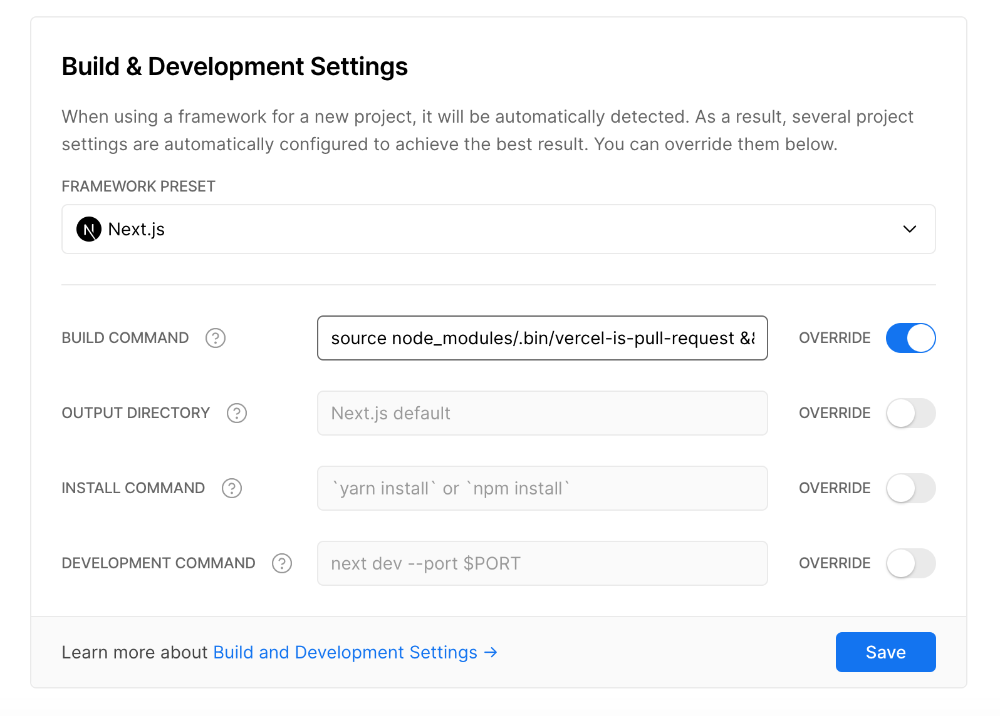

Vercel has added a [System Variable](https://vercel.com/docs/concepts/projects/environment-variables/system-environment-variables#system-environment-variables) for the pull request number. This package is now deprecated.

---

# vercel-is-pull-request

CLI which adds pull request environment variables to Vercel builds.

It adds the following variables:

| Name | Description |
| --- | --- |
| `VERCEL_GIT_IS_PULL_REQUEST` | An indicator that the current build has a corresponding pull request. Example: `1`. |
| `VERCEL_GIT_PULL_REQUEST_NUMBER` | The pull request number the build corresponds to. Example: `36`. This is only set if `VERCEL_GIT_IS_PULL_REQUEST` is `1`. |

## Usage

To use this, first install it as a dependency.

```sh
npm install vercel-is-pull-request
```


Then, update your build command to include the following command:

```sh
source node_modules/.bin/vercel-is-pull-request
```

If you are building a private GitHub repository add a access token through the `--auth` argument like so: 

```sh
source node_modules/.bin/vercel-is-pull-request --auth githubaccesstoken
```



Now inside your build step you can access the added environment variables to change the build.

```js
if (process.env.VERCEL_GIT_IS_PULL_REQUEST === '1') {
  console.log(`Building preview of pull request: https://github.com/useparcel/vercel-is-pull-request/pulls/${process.env.VERCEL_GIT_PULL_REQUEST_NUMBER}`)
}
